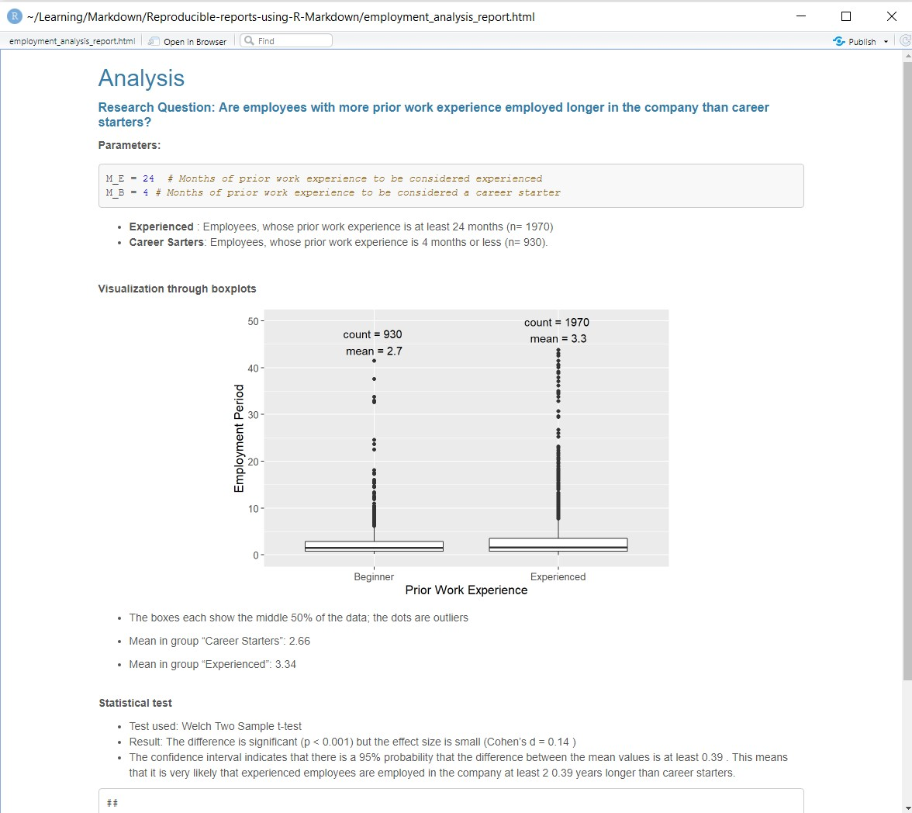

# Reproducible-reports-using-R-Markdown

### Table of Contents

1. [Installation](#installation)
2. [Project Description](#project)
3. [Results](#results)

## Installation 
 The R Markdown (.Rmd) file can be run by executing rmarkdown::render("employment_analysis_report.Rmd") in R.
 
## Project Description  
This project showcases how to create reproducible reports in R Markdown. It uses as an example the analysis of employment times depending on previous work experience.  
In the report, 2 parameters can be changed (months of previous work experience required to be considered a career starter/experienced, which will adjust the report and the included boxplots accordingly. 

## Results 
The output is an html document as shown here 
